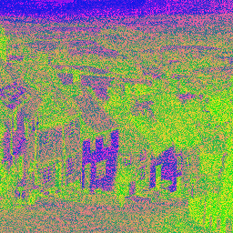

# Bitmap Transformer
***Authors: Benjamin West, Kristian Esvelt, and Wyatt Pefley*** 

***Version 1.0.0***
## Build Status: 
___

## Overview
This group lab project allows the users to make transformation to a bitmap picture via the CLI.
THis is achieved by utilizing Node's file system functionality in order to read an existing bitmap file and create an entirely new photo with an added transformation. 
- Our application also includes CLI validation to ensure that the required data is input correcly and also includes a shorthand feature in which the user can type shorthand names into the terminal to make transformations, the shorthand for the transformations in our app are:
1. ```bw```: performs a greyscale transformation,
2. ```rand```: a random transformation,
3. ```night```: performs the nightVision transformation,
4. ```nightvision```: also performs the nightVision transformation,
5. ```speck```: performs the speckles transformation,
6. ```pink```: performs the pinky transformation,
7. ```blue```: performs blueScale transform,
8. ```gold```: performs golden transformation,
9. ```slime```: performs superSlimey transformation,
## Getting Started
- Fork and clone the repository
- install dependencies using the ```npm i``` command in your terminal,
- run the following command in your terminal and input the correct data separated by spaces:


  ***Note: <> are not required for commands!**
- ```node Transformer-cli.js <OriginalPhotoName> <OutputName> <Desired Transformation>```
### Example: 
-  ```node Transformer-cli.js house.bmp superSlimey.bmp superSlimey```
- **This command would transform this image:**

  
- **And output this image:**

  
___
- To test code, simply run the  ```npm run test``` command in your terminal and watch for <span style="color:green">GREEN</span>. Testing is done in this appliction using the Jest testing suite and also Travis CI for continuous integration.

## Architecture
- JavaScript,
- Node.js
- ESLint,
- Travis CI,
- Jest,
- fs
